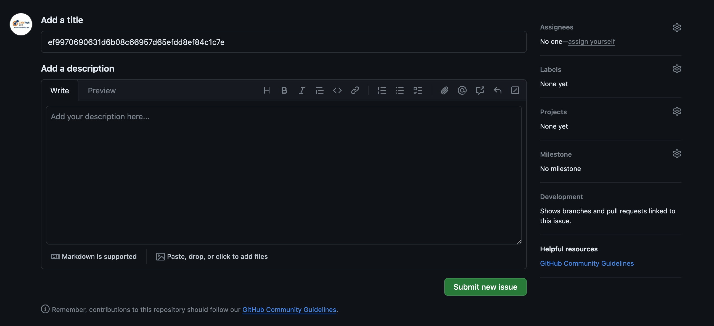
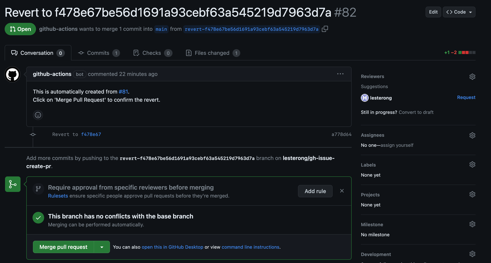

# CivicTech Lab Website

## TinaCMS

TinaCMS with visual editing is integrated into this website for ease of content updates.

To access the CMS, simply visit the `/admin` route. For example, if your site is deployed at `https://www.example.com`, to open TinaCMS, go to `https://www.example.com/admin`.

On the development server, you may have to access `/admin/index.html` instead.

## Reverting to a previous version

The website can be reverted to a previous version by creating an issue on GitHub.

1. Look for the previous commit to revert in the [commits page](../../commits).
2. Copy the commit number (full SHA) of the commit.
   
3. Enter the issue tab at the [issues tab](../../issues).
4. Create an issue with the commit number as the title. Click 'Submit new issue'.
   
5. The issue will be closed automatically. If a valid commit number is provided, a pull request will be created at the [pull requests tab](../../pulls).
6. Click on 'Merge Pull Request' to confirm the revert. Otherwise, simply select 'Close pull request' at the bottom of the page to cancel.
   

## For developers

This website is developed using Astro + React + Bootstrap + TinaCMS. React is used to enable visual editing on TinaCMS.

### Getting started

1. Clone this repository
2. Install dependencies
   ```
   yarn install
   ```
3. Run the local development server
   ```
   yarn dev
   ```

### Deployment

1. The environment variables `TINA_CLIENT_ID` and `TINA_TOKEN` are necessary for a successful deployment. The `TINA_SEARCH_TOKEN` is optional, but may be included to enable the search functionality in TinaCMS. See [Tina Cloud Documentation](https://tina.io/docs/tina-cloud/overview/) for more details.
2. Build the website using `yarn build` and deploy the website using the `dist` folder.

### Content Files

This website uses specific file names to display the data. All content files are located in `src/content/`

**Home Page / Index Page**

- A file, `src/content/home/home.json` is required, all other files in this folder are ignored. See `homeCollection` in `src/content/config.ts` for the schema of the file.

**Team Page**

- A file `src/content/team/team.json` is required. All other files in this folder are ignored. See `teamCollection` `src/content/config.ts` for the schema of the file.

**Projects Page**

- All `JSON` files placed in `src/content/projects` will be displayed. See `projectsCollection` in `src/content/config.ts` for the schema of each file.
- A route at `projects/file-name` is automatically generated to display the contents.

**News Page**

- All `mdx` files placed in `src/content/news` will be displayed. See `newsCollection` in `src/content/config.ts` for the schema of each file.
- A route at `news/file-name` is automatically generated to display the contents.

**Join Us**

- A file, `src/content/joinus/jobs.json` is required, all other files in this folder are ignored. See `joinUsCollection` in `src/content/config.ts` for the schema.
